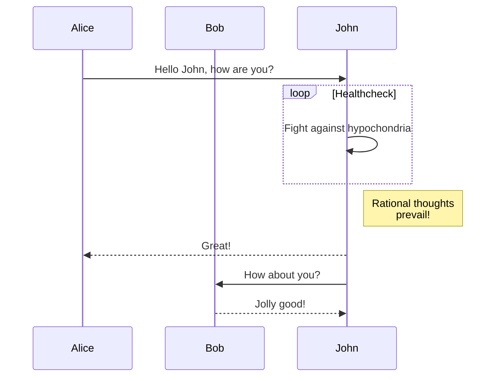

### Tips

Using a `{: .block-tip}` attribute:

```markdown
> ##### TIP
>
> This guide is last tested with @napi-rs/canvas^0.1.20, so make sure you have
> this or a similar version after installation.
{: .block-tip }
```

> ##### TIP
>
> This guide is last tested with @napi-rs/canvas^0.1.20, so make sure you have
> this or a similar version after installation.
{: .block-tip }

### Warnings

Using a `{: .block-warning}` attribute:

```markdown
> ##### WARNING
>
> Be sure that you're familiar with things like async/await and object destructuring
> before continuing, as we'll be making use of features like these.
{: .block-warning }
```

> ##### WARNING
>
> Be sure that you're familiar with things like async/await and object destructuring
> before continuing, as we'll be making use of features like these.
{: .block-warning }

### Dangers

Using a `{: .block-danger}` attribute:

```markdown
> ##### DANGER
>
> You cannot delete an ephemeral message.
{: .block-danger }
```

> ##### DANGER
>
> You cannot delete an ephemeral message.
{: .block-danger }

[1]: https://discordjs.guide/popular-topics/canvas.html#setting-up-napi-rs-canvas
[2]: https://kramdown.gettalong.org/quickref.html#block-attributes


### footnotes

This jekyll-theme supports [MathJax](https://www.mathjax.org/) to render footnotes
in markdown.

```markdown
The well known Pythagorean theorem $x^2 + y^2 = z^2$ was
proved to be invalid for other exponents[^1].
Meaning the next equation has no integer solutions:

$$ x^n + y^n = z^n $$
```


### latex

This jekyll-theme supports [MathJax](https://www.mathjax.org/) to render $\LaTeX$
and mathematics expressions.

```markdown
The well known Pythagorean theorem $x^2 + y^2 = z^2$ was
proved to be invalid for other exponents.
Meaning the next equation has no integer solutions:

$$ x^n + y^n = z^n $$
```

The well known Pythagorean theorem $x^2 + y^2 = z^2$ was
proved to be invalid for other exponents.
Meaning the next equation has no integer solutions:

$$ x^n + y^n = z^n $$

Another example with more complex markups:

```markdown
When $a \ne 0$, there are two solutions to $ax^2 + bx + c = 0$ and they are

$$x = {-b \pm \sqrt{b^2-4ac} \over 2a}.$$
```

When $a \ne 0$, there are two solutions to $ax^2 + bx + c = 0$ and they are

$$x = {-b \pm \sqrt{b^2-4ac} \over 2a}.$$

Refer to the [MathJax website](https://docs.mathjax.org/en/latest/index.html) for more examples.

### diagrams

This jekyll-theme supports [mermaid.js](https://mermaid.js.org/) to render diagrams
in markdown.

Then you can use mermaid syntax in your markdown:

```
graph TD;
    A-->B;
    A-->C;
    B-->D;
    C-->D;
```


Or, even some complex examples:

```
sequenceDiagram
    participant Alice
    participant Bob
    Alice->>John: Hello John, how are you?
    loop Healthcheck
        John->>John: Fight against hypochondria
    end
    Note right of John: Rational thoughts <br/>prevail!
    John-->>Alice: Great!
    John->>Bob: How about you?
    Bob-->>John: Jolly good!
```



### wide tables

A wide tables needs to be wrapped into a `div` with class `table-wrapper`
to make sure it displayed as expected on mobile devices. For example,

```markdown
<div class="table-wrapper" markdown="block">

|title1|title2|title3|title4|title5|title6|title7|title8|
|:-:|:-:|:-:|:-:|:-:|:-:|:-:|:-:|
|1|2|3|4|5|6|7|8|
|1|2|3|4|5|6|7|8|
|1|2|3|4|5|6|7|8|
|1|2|3|4|5|6|7|8|

</div>


### page cover

The jekyll-gitbook theme supports adding a cover image to a specific page by adding
a `cover` field to the page metadata:

```diff
  ---
  title: Page with cover image
  author: Tao He
  date: 2022-05-24
  category: Jekyll
  layout: post
+ cover: /assets/jekyll-gitbook/dinosaur.gif
  ---
```

### toc
The jekyll-gitbook theme leverages [jekyll-toc][1] to generate the *Contents* for the page.
The TOC feature is not enabled by default. To use the TOC feature, modify the TOC
configuration in `_config.yml`:

```yaml
toc:
    enabled: true
```

#### four sharp
##### five sharp

Why this repo
-------------

long contents .....

1. a
2. b
3. c
4. da

### Sub title 1


### Long contents
Long contents
-------------

long contents .....

1. a
2. b
3. c
4. d